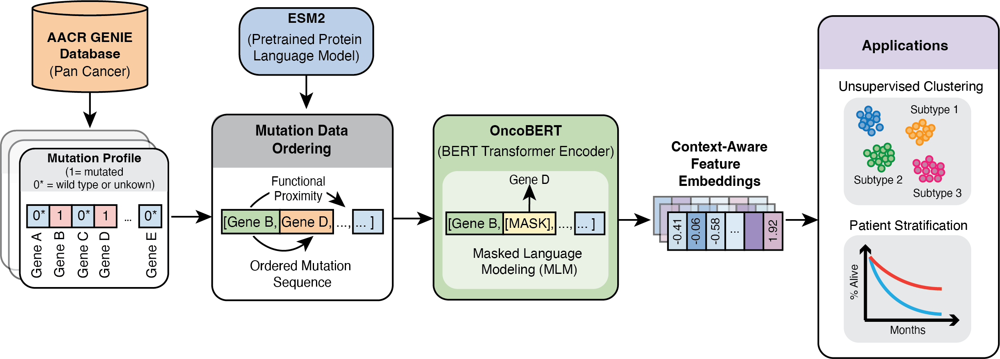

# OncoBERT
## Overview

OncoBERT is a language model that learns contextual representations cancer somatic mutations from large-scale clinical sequencing data. These learned vector representations:

- Enable clustering of tumor samples into distinct molecular subtypes  
- Reveal clinically relevant mutational contexts
- Enhance prediction of treatment response



---
## Input Data Preparation
Prepare somatic mutation data as a tabular file where each row rempresents a tumor sample and each column represents a protein coding gene. Each entry encodes the mutation status of a gene. 1: presence of at least one non-silent mutation (i.e., missense, nonsense, frameshift, indel), 0 = wildtype, */nan = not profiled. 
```
sample_id, TP53, KRAS, EGFR, ...
S1, 1, 0, 0
S2, 1, 1, 0
S3, 0, 0, 1
```
Given somatic mutation calls from a cohort saved in mutation annotation format (MAF), run the following function to transform it into the tabular format shown above:
```python
from oncobert.utils import prepare_mutation_data

prepare_input_data(mafpath = '/path/to/maf_file.txt', saveloc = '.', savename = 'yourfilename.txt')
```
## Extracting Pretrained Protein Language Model Embeddings
To extract ESM2 protein language model embeddings for each protein coding gene, follow instructions shown [here](https://github.com/facebookresearch/esm). Finally run the following script to merge and save all embeddings into one tensor:
```python
from oncobert.utils import save_esm_embeddings_to_h5py

save_esm_embeddings_to_h5py(embeddings_loc = '/path/to/saved/embeddings/*.pt')
```

## Training
To train OncoBERT from scratch on your own somatic mutation dataset, run the following script:
```
python train.py [-h] [--mut_data MUT_DATA] [--plm_embeddings PLM_EMBEDDINGS] [--save_loc SAVE_LOC] [--num_epochs NUM_EPOCHS]
                [--context_length CONTEXT_LENGTH] [--lr LR] [--batch_size BATCH_SIZE] [--embed_dim EMBED_DIM] [--num_layers NUM_LAYERS]
                [--num_workers NUM_WORKERS] [--mask_fraction MASK_FRACTION]

Training script arguments

options:
  -h, --help            show this help message and exit
  --mut_data MUT_DATA   Path to mutation data (saved in tabular csv format)
  --plm_embeddings PLM_EMBEDDINGS
                        Path to h5 file storing ESM2 protein language model embeddings
  --save_loc SAVE_LOC   Path to where model weights are saved
  --num_epochs NUM_EPOCHS
                        Number of training epochs (default: 500)
  --context_length CONTEXT_LENGTH
                        Sequence/context length (default: 50)
  --lr LR               Learning rate (default: 1e-4)
  --batch_size BATCH_SIZE
                        Batch size (default: 64)
  --embed_dim EMBED_DIM
                        Embedding dimension (default: 256)
  --num_layers NUM_LAYERS
                        Number of Stacked Transformer layers (default: 8)
  --num_workers NUM_WORKERS
                        number of workers for data loader (default: 12)
  --mask_fraction MASK_FRACTION
                        fraction of tokens to be masked during training (default: 0.2)
```

## Inference
To generate contextual embeddings of somatic mutations and optionally classify tumor samples into distinct mutation subtypes, run the following scripts:
```
python inference.py [-h] [--mut_data MUT_DATA] [--plm_embeddings PLM_EMBEDDINGS] [--checkpoint CHECKPOINT] [--save_loc SAVE_LOC]
                    [--savename SAVENAME] [--context_length CONTEXT_LENGTH] [--embed_dim EMBED_DIM] [--num_layers NUM_LAYERS]
                    [--classifier_chkpt CLASSIFIER_CHKPT]

Inference script arguments

options:
  -h, --help            show this help message and exit
  --mut_data MUT_DATA   Path to mutation data (saved in tabular csv format)
  --plm_embeddings PLM_EMBEDDINGS
                        Path to h5 file storing ESM2 protein language model embeddings
  --checkpoint CHECKPOINT
                        Path to checkpoint file where OncoBERT weights are saved
  --save_loc SAVE_LOC   Location where embeddings will be saved
  --savename SAVENAME   name of embeddings file (e.g., bert_embeddings.h5)
  --context_length CONTEXT_LENGTH
                        sequence/context length (default: 50)
  --embed_dim EMBED_DIM
                        embedding dimensions (default: 256)
  --num_layers NUM_LAYERS
                        number of transformer blocks (default: 8)
  --classifier_chkpt CLASSIFIER_CHKPT
                        path to MLP classifier weights (default: None)
```
## Questions and Issues
If you find any bugs or have any questions about this code please contact: [Sushant Patkar](patkar.sushant@nih.gov)

## Citation
If you found OncoBERT useful in your own work, please consider citing:
```
```

