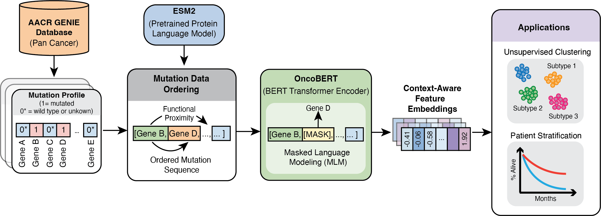

## Overview

**OncoBERT** is a language model that learns contextual representations cancer somatic mutations from large-scale clinical sequencing data. These learned vector representations enable:

- Clustering of tumor samples into distinct molecular subtypes  
- Discovery of recurrent mutation co-occurrence patterns  
- Prediction of treatment response



OncoBERT interprets mutation profiles of tumors as "sentences" where genes represent "tokens", and their ordering captures crucial contextual information about mutations. The model is trained to recognize various mutation patterns via masked language modeling, a self-supervised learning technique designed to interpret natural langauge. The final model outputs a **256-dimensional embedding vector** that encodes the mutational context of each tumor sample. 

---
## Input Data Preparation
Prepare somatic mutation data as a tabular file where each row rempresents a tumor sample and each column represents a protein coding gene. Each entry encodes the mutation status of a gene. 1: presence of at least one non-silent mutation (i.e., missense, nonsense, frameshift, indel), 0 = wildtype, */nan = not profiled. 
```
sample_id, TP53, KRAS, EGFR, ...
S1, 1, 0, 0
S2, 1, 1, 0
S3, 0, 0, 1
```


## Training
To train OncoBERT from scratch on your own cohort, run the following:
```
```

## Inference
To generate embeddings for your own cohort run the following:
```
```
## Questions and Issues
If you find any bugs or have any questions about this code please contact: [Sushant Patkar](patkar.sushant@nih.gov)

## Citation

## Acknowledgments
